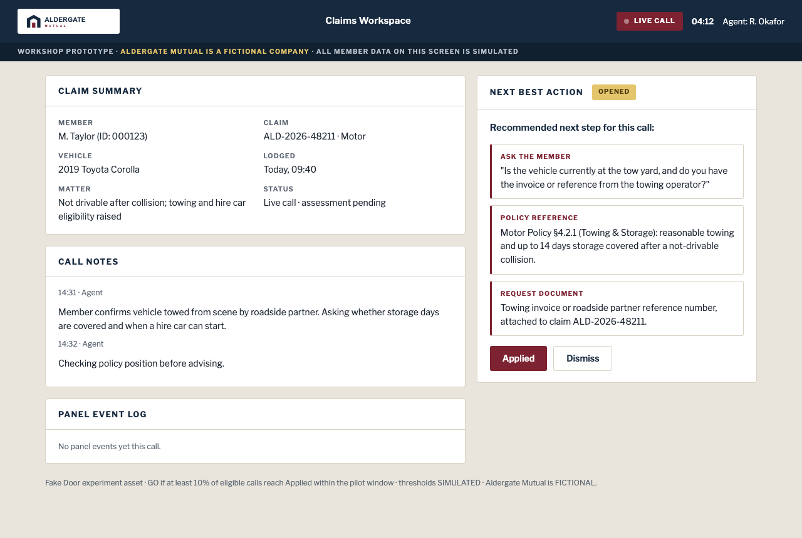

# Rapidly MCP

## Make every AI idea earn the build

AI can make almost any idea look convincing. The question hasn't changed: what should we do?

Rapidly puts our idea-to-experiment method inside any agent that supports remote MCP. That includes Claude Code, Codex, ChatGPT, Hermes, OpenClaude, Grokbot and other MCP-capable agents. Bring a company, a problem or an idea. Rapidly helps your agent turn it into:

1. a grounded idea;
2. a Lean Canvas;
3. a measurable customer behaviour and pass threshold;
4. Pretotyping experiment options and a recommended first test;
5. a build prompt for the test assets.

From idea to an experiment ready to run in five minutes.

Rapidly designs the experiment. Your AI client or development tool builds the assets. Real customers give you the evidence.

[Connect Rapidly](https://www.rapidly.co/rapidly-mcp) · [Setup instructions](docs/quickstart.md) · [Example prompts](docs/examples.md)

## One idea, five minutes

> Test this idea: an AI copilot that helps our claims agents during live phone calls.

Rapidly found the risky assumption, set a proposed pass mark and designed the first test. The returned build prompt produced this test asset:



This result was assembled from two real Rapidly runs on 20 August 2026. Aldergate Mutual is fictional, and the targets are proposals for review, not measured results. Your run uses your idea.

## Why can't I just ask AI?

You can, and the answer will probably look reasonable. Two things will be missing.

**The discipline.** A one-off prompt rarely pins down what a real customer must do before the conversation slides into implementation. Rapidly keeps the work on the customer, risky belief, observable behaviour, pass threshold and smallest useful test.

**The memory.** A chat answer dies in the thread. Rapidly saves successful work to the team you authorise and keeps each experiment under the idea it tests. Your team can use the evidence to fund, fix, stop or test next.

The method is Alberto Savoia's Pretotyping plus our own practice through [4,000+ experiments with client teams](https://www.exponentially.com/) and 200+ workshops. The agent still builds. Rapidly helps you decide what deserves the build.

## Connect

MCP is the open standard that lets your AI client call hosted tools. Rapidly runs the server, so there is no server code to install.

Rapidly uses one address:

```text
https://www.rapidly.co/mcp
```

### New to Rapidly

Open [rapidly.co/rapidly-mcp](https://www.rapidly.co/rapidly-mcp). Enter your name, email and team name. Rapidly creates the account and team, then shows a personal token once.

The page has tested, copy-ready setup for:

- Codex CLI using the personal token;
- Claude Code using the personal token.

### OAuth

Existing Rapidly team members use OAuth. The tested Codex app route works for either a new `/rapidly-mcp` account or an existing Rapidly team.

OAuth is available in:

- Codex app;
- Codex CLI;
- Claude Code;
- Claude custom connectors, with setup documented but not included in the recorded Rapidly production smoke;
- ChatGPT custom MCP apps on eligible plans.

Other agents can connect when they support a remote HTTPS MCP server plus OAuth or a secure Authorization header. You can ask Hermes, OpenClaude, Grokbot or another MCP-capable agent to add Rapidly using `https://www.rapidly.co/mcp`.

Choose the intended Rapidly team and approve access when the client asks. The client instructions differ, so use the exact steps in the [Setup instructions](docs/quickstart.md).

## Run the test

### Generate an idea

Start with a company or type of business:

```text
Ask Rapidly for one business idea for an independent bookstore.
```

Rapidly generates one grounded idea with cited public sources, then offers the next method step.

### Test an idea you already have

```text
Use Rapidly to test this idea: [describe the customer, problem and proposed change].
```

Include what you already know, the source of that information and any constraints that matter.

After each result, accept the next Rapidly step. This can be as simple as replying `yes`. If the client doesn't offer it, ask Rapidly to continue the same idea through its Lean Canvas, hypothesis and experiment stages.

A useful result contains:

- the same idea carried through each stage;
- sources you can open and facts you can review;
- a measurable customer behaviour and proposed pass threshold;
- Pretotyping options, GO and NO-GO rules, and a recommended smallest experiment;
- a build prompt for the test assets, not a claim that Rapidly built them;
- saved work under the authorised team when your connection has team access.

See [Example prompts](docs/examples.md) for both starting paths.

## After the first test

Successful work saves to your authorised Rapidly team. The experiment stays under the idea it tested, with the result and lesson.

Bring the next idea, then the next. Team tools can review the portfolio, show experiment coverage and prepare a sprint pack around the focus idea.

One test answers one question. The portfolio helps the team decide where the next sprint should go.

## Beta testing

Please use a real, non-confidential idea unless your organisation has approved sending the information through your AI client and Rapidly.

We want to know:

- Did the connection work on the first attempt?
- Did Rapidly understand the customer and problem?
- Did idea generation return something relevant and properly sourced?
- Was the hypothesis measurable?
- Was the recommended experiment small enough to run?
- Was the build prompt good enough to use?
- What was confusing, wrong or missing?

Email [hello@rapidly.co](mailto:hello@rapidly.co) with the subject `Rapidly MCP beta feedback`. Include the client and version, connection type, where you stopped and a redacted description of the result. Remove tokens, customer data and confidential details from all feedback, logs and screenshots.

## Current limits

- A trial includes five ideas per account.
- Continuing the same idea through its Canvas, hypothesis and experiments doesn't use another idea.
- Starting a new idea or branching one does.
- Generated facts, cited sources and proposed targets need human review before use.
- The live `tools/list` response is the authority for the tools available to your connection.

## Guides

- [Setup instructions](docs/quickstart.md)
- [Example prompts](docs/examples.md)
- [Troubleshooting](docs/troubleshooting.md)
- [Security and privacy](docs/security-and-privacy.md)
- [Support](SUPPORT.md)
- [Security reports](SECURITY.md)

## Repository scope

This repository documents Rapidly's hosted MCP service. It does not contain the production server source code.

The [MIT licence](LICENSE.md) covers the files in this repository. The hosted service, Rapidly application source, method implementation, and Rapidly and Exponentially names and marks remain proprietary to Exponential Innovation Pty Ltd.
