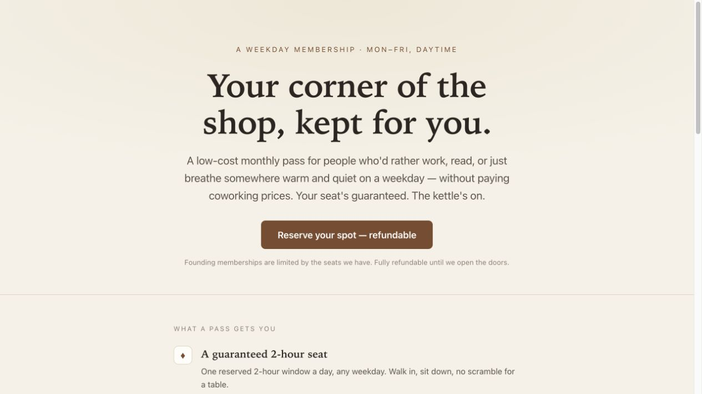

# Rapidly MCP

## Test the idea before you build it

Rapidly works inside your AI agent. Bring an idea you already have, or ask it to generate one from a company website. In about five minutes, you get a build prompt for the smallest Pretotyping experiment worth running.

Rapidly builds the Lean Canvas, turns the riskiest assumption into a measurable hypothesis, researches a pass mark and designs practical experiments. Your agent builds the test. Real customers give you the evidence.

Works with Claude, Codex, ChatGPT and Hermes. OpenClaw, Grokbot and other agents can also use Rapidly if they support remote MCP.

[Connect Rapidly](https://www.rapidly.co/rapidly-mcp) · [Install the Agent Plugin](docs/agent-plugin.md) · [Let your agent set it up](docs/for-agents.md) · [Manual setup](docs/quickstart.md)

## Here's what a first run looks like

> A suburban independent bookshop wants to grow weekday foot traffic and build a younger, regular customer base.

Rapidly generated three ideas. We chose the Third-Place Pass: a $19 monthly membership with a guaranteed two-hour weekday seat, a rotating perk and a members' shelf.

Rapidly built the Lean Canvas, turned the riskiest demand assumption into a measurable hypothesis and proposed five Pretotyping experiments. The simplest started with staff asking warm, local customers to pay. The next used a counter card and landing page, with a proposed pass mark of 15%.



[See the complete Rapidly run](https://www.exponentially.com/experiments/rapidly-mcp/) · [Open the customer-facing landing page](https://www.exponentially.com/experiments/rapidly-mcp/pretotypes/third-place-pass/)

This was a demonstration for a hypothetical bookshop. The pass mark was a proposal to test, not a measured result. No customer results are claimed.

## Why can't I just ask Claude or Codex?

You can. We do. The answer will probably look reasonable.

Rapidly is useful because the method is already there. For one idea, the core run:

1. builds a full Lean Canvas with `independent_design_lean_canvas`;
2. turns the riskiest assumption into a market engagement hypothesis and researches the pass threshold with `independent_design_hypothesis`;
3. creates three to five named Pretotyping experiments, recommends the smallest useful one and returns its build prompt with `independent_design_experiments`.

[See all 21 Rapidly tools and what they do](docs/tools.md).

Successful work is also saved with the idea in your Rapidly team instead of disappearing in a chat thread. You can bring the result back later and decide whether to fund it, fix it, stop it or run another test.

The method combines Alberto Savoia's Pretotyping with our own practice through [4,000+ experiments with client teams](https://www.exponentially.com/) and 200+ workshops.

## Connect Rapidly

### Install the Agent Plugin

This repository is an Agent Plugins 1.0 package. Supported agents can install it to get the Rapidly MCP connection and the `rapidly-test-before-build` workflow together.

In VS Code, run **Chat: Install Plugin From Source** and enter:

```text
https://github.com/Exponentially-Platform/Rapidly-MCP
```

[See Agent Plugin setup for VS Code, GitHub Copilot, Cursor and Codex](docs/agent-plugin.md).

### If you're new to Rapidly

Open [rapidly.co/rapidly-mcp](https://www.rapidly.co/rapidly-mcp) and enter your name, email and team name. Rapidly creates the account and team, then shows your personal token once.

The page gives you copy-ready setup for Codex CLI and Claude Code. Follow the steps, start a fresh conversation and you're ready to try an idea.

### If you already use Rapidly

Connect with OAuth, choose your Rapidly team and approve access. You don't need to create another account or personal token.

The exact steps differ between Codex, Claude and ChatGPT. Use the [setup instructions](docs/quickstart.md) for your agent.

### If you're using another agent

Give your agent this address and ask it to connect Rapidly:

```text
https://www.rapidly.co/mcp
```

Use OAuth if the agent supports it. Otherwise, follow the [agent setup instructions](docs/for-agents.md) to keep your personal token out of chat and project files.

## Start with an idea

Use one you already have:

```text
Ask Rapidly to test this idea: [describe the customer, problem and proposed change].
```

Or ask Rapidly to generate one from a company and its website:

```text
Ask Rapidly to generate [one or more] ideas for [company name] using [website URL]. Focus on [optional customer, problem or opportunity].
```

Rapidly researches the company, returns grounded ideas with sources and offers to take one through the method. If you're bringing your own idea, add anything you already know, where that information came from and any constraints that matter.

Rapidly works through the method one stage at a time. After each result, accept the next step. This can be as simple as replying `yes`. If your agent doesn't offer it, ask Rapidly to continue the same idea.

By the end, you should have:

- sources you can open and facts you can review;
- a full Lean Canvas;
- a market engagement hypothesis with a measurable customer behaviour and proposed pass threshold;
- three to five Pretotyping options, GO and NO-GO rules, and a recommended first experiment;
- a build prompt for the test asset.

Review the output, ask your agent to build the asset, then put the test in front of real customers.

[See more example prompts](docs/examples.md)

## Help us improve Rapidly MCP

We're looking for the points where this becomes confusing or stops being useful.

After your run, please tell us:

- Did the connection work the first time?
- Where did you hesitate or get stuck?
- Was the proposed experiment small enough to run?
- What did you keep, and did it change what you planned to do next?

Email [hello@rapidly.co](mailto:hello@rapidly.co) with the subject `Rapidly MCP feedback`. Tell us which agent you used and where you stopped. We won't share your idea, feedback or results publicly without asking you first. Please remove tokens and customer data from feedback, logs and screenshots.

## Current limits

- A trial includes five new ideas. Taking one idea through its Canvas, hypothesis and experiments still counts as one idea.
- Need more? Email [hello@rapidly.co](mailto:hello@rapidly.co) to discuss the right next step for your team.
- Generated facts, cited sources and proposed targets need human review before use.

## Guides

- [Setup instructions](docs/quickstart.md)
- [Agent Plugin installation](docs/agent-plugin.md)
- [Example prompts](docs/examples.md)
- [Troubleshooting](docs/troubleshooting.md)
- [Security and privacy](docs/security-and-privacy.md)
- [Support](SUPPORT.md)
- [Security reports](SECURITY.md)
